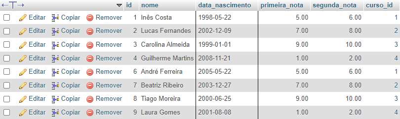
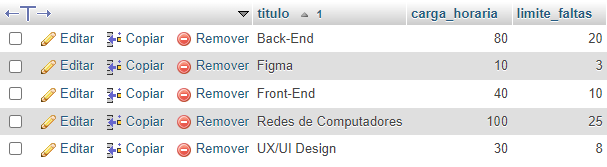

# Exercícios de Banco de Dados

## INSERT

```sql
INSERT INTO cursos (titulo, carga_horaria) VALUES ('Front-End', 40), ('Back-End', 80), ('UX/UI Design', 30), ('Figma', 10), ('Redes de Computadores', 100);

INSERT INTO professores (nome, area_atuacao, curso_id) VALUES ('Pedro Silva', 'infra', 5), ('Ana Santos', 'design', 4), ('João Oliveira', 'design', 3), ('Sofia Rodrigues', 'desenvolvimento', 2), ('Miguel Pereira', 'desenvolvimento', 1);

INSERT INTO alunos (nome, data_nascimento, primeira_nota, segunda_nota, curso_id) VALUES ('Inês Costa', '1998-05-22', 5.00, 6.00, 1), ('Lucas Fernandes', '2002-12-09', 7.00, 8.00, 2), ('Carolina Almeida', '1999-01-01', 9.00, 10.00, 3), ('Guilherme Martins', '2008-11-21', 1.00, 2.00, 4), ('Maria Sousa', '2009-03-03', 3.00, 4.00, 5), ('André Ferreira', '2005-05-22', 5.00, 6.00, 1), ('Beatriz Ribeiro', '2003-12-27', 7.00, 8.00, 2), ('Tiago Moreira', '2000-06-25', 9.00, 10.00, 3), ('Laura Gomes', '2001-08-08', 1.00, 2.00, 4), ('Diogo Carvalho', '2010-09-10', 3.00, 4.00, 5);
```

## UPDATE

```sql
UPDATE cursos SET professor_id = 15 WHERE id = 1;
UPDATE cursos SET professor_id = 14 WHERE id = 2;
UPDATE cursos SET professor_id = 13 WHERE id = 3;
UPDATE cursos SET professor_id = 12 WHERE id = 4;
UPDATE cursos SET professor_id = 11 WHERE id = 5;
```

## SELECT

### (1)

```sql
SELECT * FROM alunos WHERE data_nascimento < '2009-01-01';
```


### (2)

```sql
SELECT nome, ROUND((primeira_nota + segunda_nota) / 2, 2) AS media FROM alunos;
```


### (3)

```sql
SELECT titulo, carga_horaria, ROUND(carga_horaria * 0.25) AS limite_faltas FROM cursos ORDER BY titulo;
```
