# Exercícios de Banco de Dados - Etapa 3

## CRUD - Consultas

***Atenção**: todos os comandos bem-sucedidos devem ser documentados e colocados no seu repositório do exercício.*

### 1) Faça uma consulta que mostre os alunos que nasceram antes do ano 2009

```sql
SELECT * FROM alunos 
    WHERE data_nascimento < '2009-01-01';
```
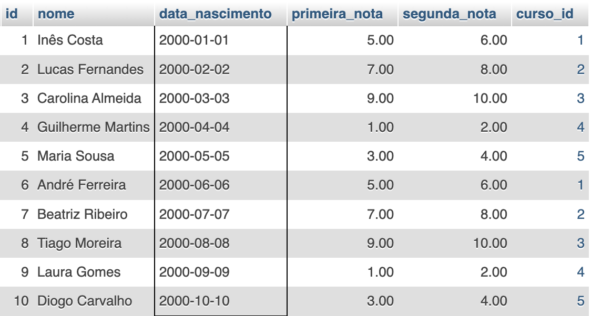

---

### 2) Faça uma consulta que calcule a média das notas de cada aluno e as mostre com duas casas decimais.

```sql
SELECT nome, ROUND((primeira_nota + segunda_nota) / 2, 2) media 
    FROM alunos;
```

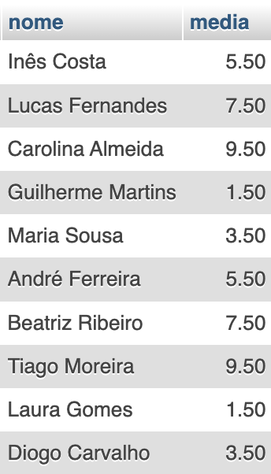

---

### 3) Faça uma consulta que calcule o limite de faltas de cada curso de acordo com a carga horária. Considere o limite como 25% da carga horária. Classifique em ordem crescente pelo título do curso.

```sql
SELECT titulo, carga_horaria, ROUND(carga_horaria * 0.25) limite_faltas 
    FROM cursos 
    ORDER BY titulo;
```
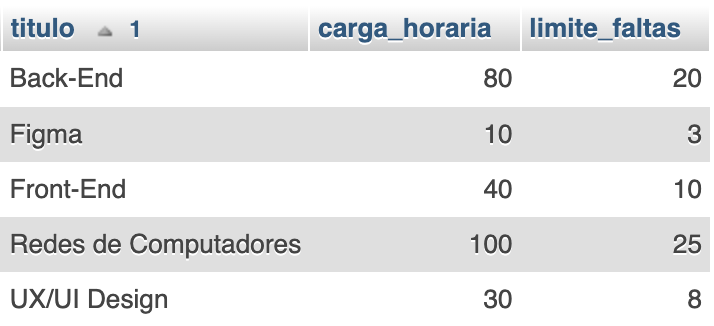

---

### 4) Faça uma consulta que mostre os nomes dos professores que são somente da área "desenvolvimento".


```sql
SELECT nome 
    FROM professores 
    WHERE area_atuacao = 'desenvolvimento';
```
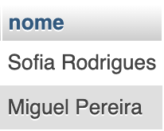

---

### 5) Faça uma consulta que mostre a quantidade de professores que cada área ("design", "infra", "desenvolvimento") possui.


```sql
SELECT area_atuacao, COUNT(*) quantidade 
    FROM professores 
    GROUP BY area_atuacao; 
```
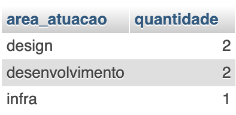

---

### 6) Faça uma consulta que mostre o nome dos alunos, o título e a carga horária dos cursos que fazem.


```sql
SELECT alunos.nome aluno, cursos.titulo nome_do_curso, cursos.carga_horaria 
    FROM alunos
    INNER JOIN cursos ON alunos.curso_id = cursos.id;
```
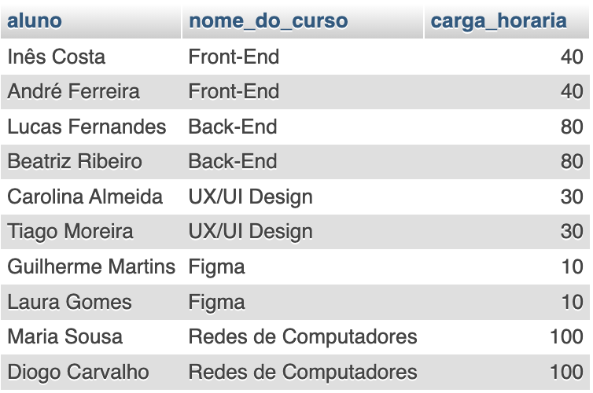

---

### 7) Faça uma consulta que mostre o nome dos professores e o título do curso que lecionam. Classifique pelo nome do professor.

```sql
SELECT professores.nome professor, cursos.titulo nome_do_curso 
    FROM professores
    INNER JOIN cursos ON professores.curso_id = cursos.id 
    ORDER BY professor;
```
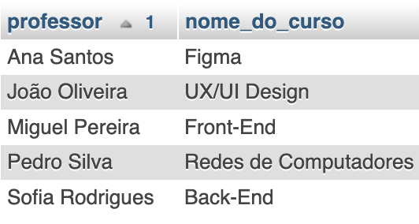

---

### 8) Faça uma consulta que mostre o nome dos alunos, o título dos cursos que fazem, e o professor de cada curso.


```sql
SELECT alunos.nome aluno, cursos.titulo nome_do_curso, professores.nome professor 
    FROM alunos
    INNER JOIN cursos ON alunos.curso_id = cursos.id
    INNER JOIN professores ON cursos.professor_id = professores.id;
```

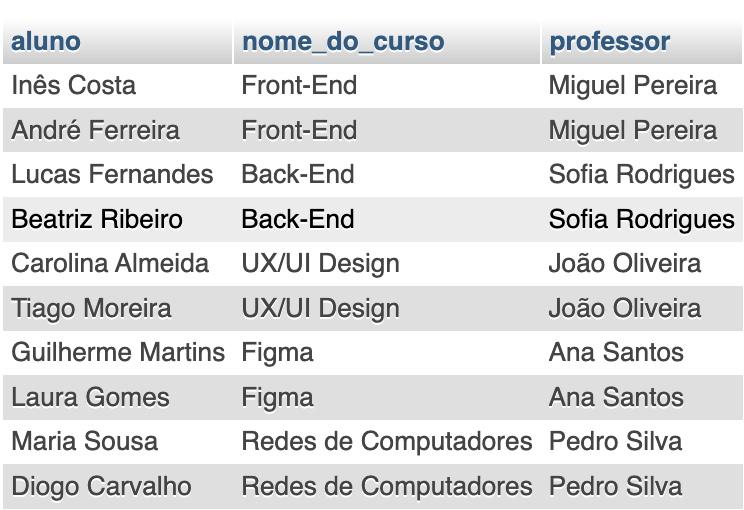

---

### 9) Faça uma consulta que mostre a quantidade de alunos que cada curso possui. Classifique os resultados em ordem descrecente de acordo com a quantidade de alunos.


```sql
SELECT cursos.titulo nome_do_curso, COUNT(alunos.curso_id) quantidade_aluno 
    FROM alunos 
    INNER JOIN cursos ON alunos.curso_id = cursos.id 
    GROUP BY nome_do_curso 
    ORDER BY quantidade_aluno DESC;
```
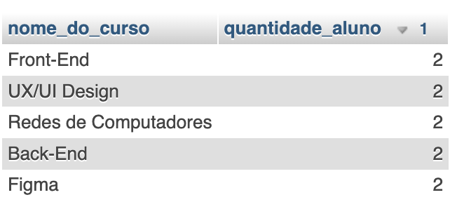

---

### 10) Faça uma consulta que mostre o nome dos alunos, suas notas, médias, e o título dos cursos que fazem. Devem ser considerados somente os alunos de Front-End e Back-End. Mostre os resultados classificados pelo nome do aluno.


```sql
SELECT alunos.nome aluno, alunos.primeira_nota, alunos.segunda_nota, ROUND((primeira_nota + segunda_nota) / 2, 2) media, cursos.titulo nome_do_curso 
    FROM alunos
    INNER JOIN cursos ON alunos.curso_id = cursos.id 
    WHERE curso_id IN(1, 2) 
    ORDER BY aluno;
```
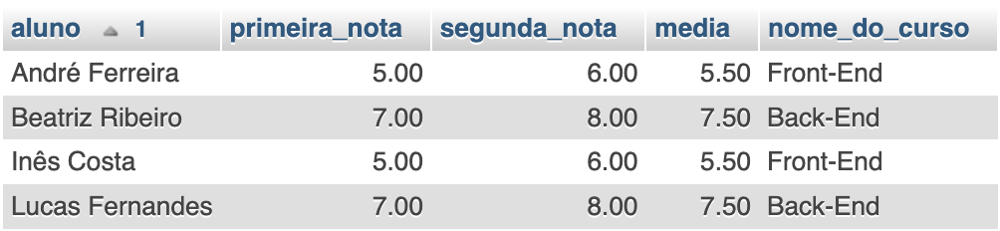

---

### 11) Faça uma consulta que altere o nome do curso de Figma para Adobe XD e sua carga horária de 10 para 15.

```sql
UPDATE cursos SET titulo = 'Adobre XD', carga_horaria = 15 WHERE id = 4;
```
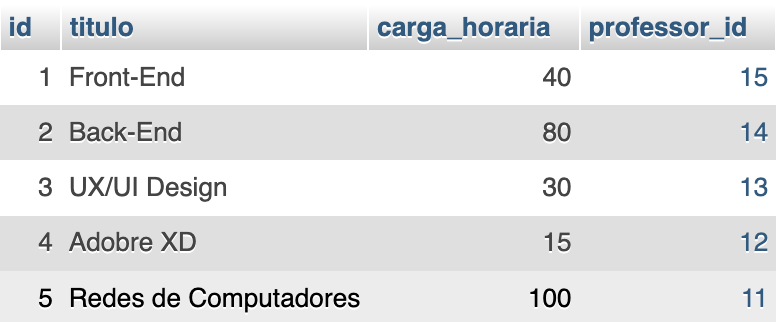

---

### 12) Faça uma consulta que exclua um aluno do curso de Redes de Computadores e um aluno do curso de UX/UI.

```sql
DELETE FROM alunos WHERE id IN(5, 3);
```

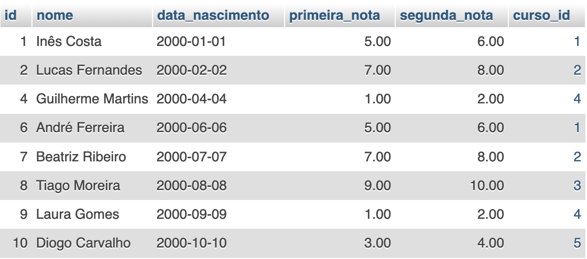

---

### 13) Faça uma consulta que mostre a lista de alunos atualizada e o título dos cursos que fazem, classificados pelo nome do aluno.

```sql
SELECT alunos.nome aluno, cursos.titulo nome_do_curso FROM alunos
    INNER JOIN cursos ON alunos.curso_id = cursos.id 
    ORDER BY aluno; 
```
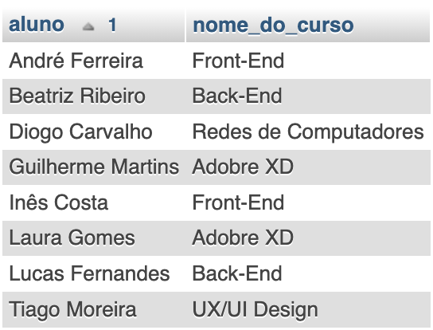

---

## DESAFIOS

1) Criar uma consulta que calcule a idade do aluno

```sql
SELECT nome, TIMESTAMPDIFF(YEAR, data_nascimento, NOW()) idade FROM alunos;
```

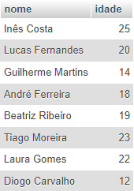

2) Criar uma consulta que calcule a média das notas de cada aluno e mostre somente os alunos que tiveram a média **maior ou igual a 7**.


```sql
-- evitar a repetição da expressão (HAVING)
SELECT nome, ROUND((primeira_nota + segunda_nota) / 2, 2) media FROM alunos HAVING media >= 7;
```
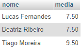

3) Criar uma consulta que calcule a média das notas de cada aluno e mostre somente os alunos que tiveram a média **menor que 7**.


```sql
SELECT nome, ROUND((primeira_nota + segunda_nota) / 2, 2) media FROM alunos HAVING media < 7;
```
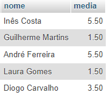

4) Criar uma consulta que mostre a quantidade de alunos com média **maior ou igual a 7**.

```sql
SELECT COUNT(id) quantidade FROM alunos WHERE ROUND((primeira_nota + segunda_nota) / 2, 2) <= 7;
```

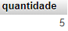